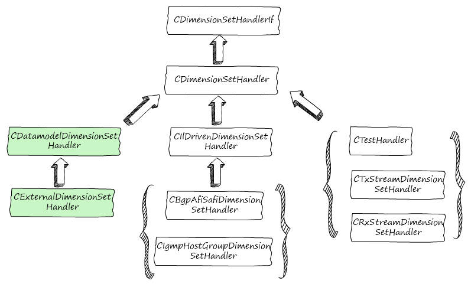
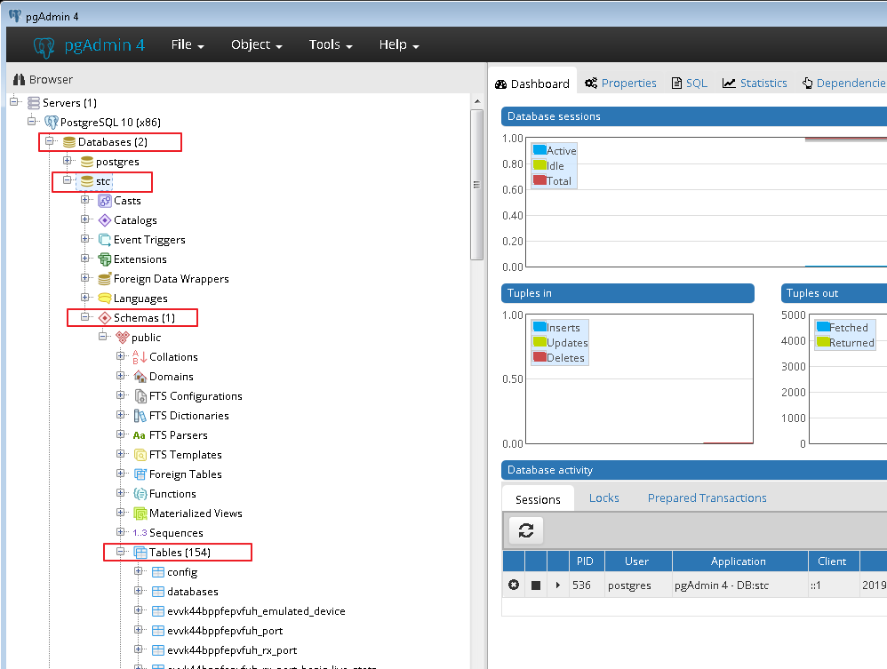
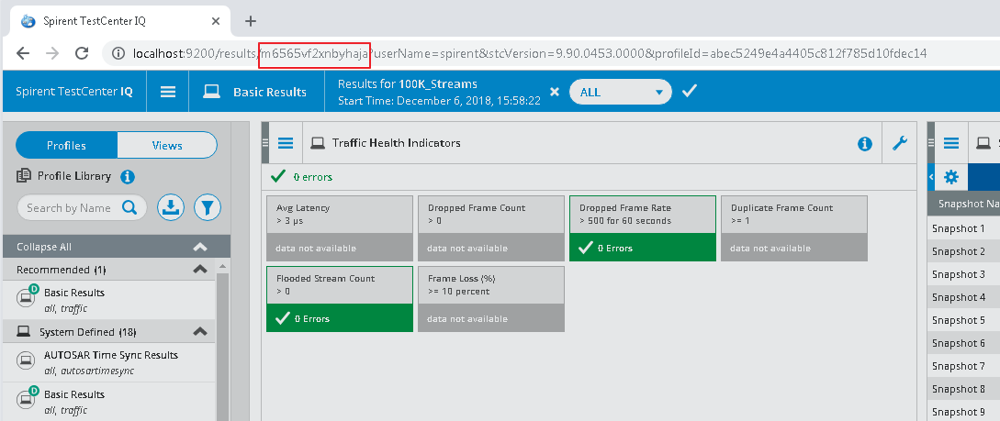

# Magellan: A Content Developer's Perspective
+ [Overview](#overview)
  - [The Grand Scheme of Magellan](#the-grand-scheme-of-magellan)
  - [Roadmap](#roadmap)
  - [Result Types](#result-types)
  - [Iteration](#Iteration)
+ [BLL](#bll)
  - [Star Data Model](#star-data-model)
  - [BLL File Locations](#bll-file-locations)
  - [Dimension Set](#dimension-set)
  - [Result Set](#result-set)
  - [Debug Tips](#bll-debug-tips)
+ [Views and Profiles](#views-and-profiles)
  - [View File Locations](#view-file-locations)
  - [Standard View](#standard-view)
  - [Drill Down View](#drill-down-view)
  - [Generator Scripts](#generator-scripts)
  - [Profiles]
  - [Debug Tips]
+ [Advanced features :sparkles:](#advanced-features)
  - [Health Indicator](#health-indicator)
  - [Chart View](#chart-view)
  - [Report](#report)
## Overview
### The Grand Scheme of Magellan
Magellan is a framework consisting of following components that loosely coupled together:
* BLL (C++)
* STC UI (C#)
* Automation (Python)
* orion-res (Go)
* Web UI (HTML, Javascript)

Content developers are farmiliar with existing components such as BLL and STC UI, but not the new ones. However, without the knowledge of how these pieces work as a whole, debugging Magellan can be difficult. As a first step toward understanding the whole framework, let's take a look on the responsibility and relations between these components.

Each component runs in its own process:


Component|Process (Windows)
---------|------------
STC UI | TestCenter.exe
BLL | TestCenterSession.exe
Orion-res | orion-res.exe
Web UI (embedded) | CefSharp.BrowserSubprocess.exe

Each component provides a set of functionalities related to Magellan:
* STC UI
    * Enable/disable Magellan (TestCenter IQ)
    * Result Selector that specify live results to subscribe
    * Brings up Embedded Web UI if Magellan is enabled
* BLL
    * Spawn orion-res process during start up
    * Subscribe to IL for results
    * Write results to orion-res using Rest API
* Orion-res
    * Transfer data received from BLL to backend database service (PostgreSQL)
    * Respond to queries from Web UI
* Web UI
    * Query results from Orion and display results in browser
    * Handle user interaction and update query accordingly


The figure above summaries the relations between components:

* BLL subscribes to IL for results and send data to orion-res upon receiving. There is no communication between IL and orion-res.
* Between BLL and orion-res, data (test results, user information etc.) almost always flow in one direction: from BLL to orion-res; except during apply, BLL may request to sync with orion-res (for test information ect.) 
* There’s no direct communication between Web UI and BLL, i.e., Web UI cannot send data to BLL, and vice versa.
* There’s no direct communication between STC UI and Web UI. It's possible for STC UI to sync with Web UI (through orion-res), but it's not possible for Web UI to directly retrieve data from STC UI.
* STC UI/Automation client communicate with BLL through STAK commands. It can also query results from orion-res through REST Api (e.g., by using Python's `request` package).
* Orion-res pushes data to backend DB. It’s usually not a concern for content developers. But knowledge on how to work with the DBs is helpful for debugging.

### Roadmap
Below is the recommended approach when developing contents with Magellan. Each step is self-contained and serves as prerequisite for the next:
1. Start with BLL development, including dimension sets, result sets. Verify that data retrieved from IL is correctly populated in Postgres database.
2. Create view files using generator scripts and verify that the results is shown correctly in embedded view and supported browser.
3. Add advanced features such as Heath Indicator (HI), Chart view, Report etc.

### Result types
Magellan supports two types of results: live result and snapshot (one-shot) result.

* Live result is automatically updated periodically similar to the classic view results. A query is sent to IL when test starts, then BLL listen to the notifications from IL and process received messages. Like classic results, live results is best-effort based; results may be dropped if the system is under pressure, which is the case for large scale tests. Therefore, result selector (see image below) is provided as a mechanism to mitigate by only subscribe counters of interests to IL. With result selector, only the counters checked will be collected from IL, thus reduce the demand on the resources such as memory and hard drive space.


* Snapshot result is saved when user select "File/Save TestCenter IQ Snapshot" from the menu, or run *SaveEnhancedResultsSnapshotCommand* in sequencer. Conceptually, it's similar to a DRV where BLL directly sends query to IL for results. Snapshot saves all counters whether or not it is checked in Result Selector. Furthermore, when taking a snapshot, live result is paused.

### Iteration
For RFC tests, clicking on the triangle on left of `Test Name` shows a drop-list of iterations (see image below), each contains a snapshot taken at the end of that iteration. For all other tests, there's only one iteration and Result Library does not show iteration drop-list in `Test Name` column.


## BLL
BLL is reponsible to subcribe to IL and write results to Orion-res. The bulk of work is done by the dimension set handlers and result set handlers. Conceptually, dimension set handler maps to data-model class (e.g., *BGP_BgpRouterConfig*) and keeps track of property changes. Result set handler creates queries and subscribe to IL. When results arrive, result set handler process the messages and write data to orion-res. Dimension set and result set handlers populate tables in database that make the query possible.

### Star Data Storage Model
In Magellan, data storage is modeled with [**star schema**](https://www.vertabelo.com/blog/technical-articles/data-warehouse-modeling-the-star-schema), and that's where dimension and result sets come into the picture. Orion-res provides [**query api**](https://github.com/SpirentOrion/orion-api/blob/master/res/doc/orion-res-query-api.md) for clients to retrieve data (private repo, check with orion team if you don't have access).

To reduce the work required for content development, part of dimension and result sets are dynamically loaded based on its YAML file, which defines the properties (for dimension sets) and facts (i.e., counters from IL tables, for result sets) that will end up being written into database. It minimizes c++ coding required to get things running. These YAML files are usually easy to understand. However, in order to load these YAML files successfully when STC starts, they must follow a pre-defined structure known to STC. This "blue print" of dimension and result set is its schema file (also a YAML file). Schema files rarely changes (please contact framework team if you find that the schema does not support the feature to be implemented) and is used for validation(e.g., for view generation). These schema files can be found at:

`//TestCenter/integration/framework/bll/core/STAKCommands/results/schema/`

:exclamation:  Whenever having questions about YAML file, first check its schema file.

### BLL File Locations
#### YAML Files
YAML files for dimension set and result set are located at:
`//TestCenter/integration/framework/bll/core/STAKCommands/results/dim/`
`//TestCenter/integration/framework/bll/core/STAKCommands/results/res/`

Each protocol should create its own sub-directory, which contains the YAML files. Result set YAML file names should end with *_stats*. As these files need to be loaded when STC initialize, they must be copied to corresponding directory before the change can take effect.

For developers, if BLL is built by running *scons* command at `STC_BUILD_ROOT` directory (i.e., `scons -j6 -f SConstruct.bll debug=1 target=bll-win32-notest`), these files will be copied over to the debug folder. However, if only a content target is built,(i.e., in content directory, run `scons -j6 -f SConscript.bll debug=1`), these YAML files will not not be copied over. In this case, manually copy it to the debug folder:

`(STC_BUILD_ROOT)/bin/Debug/STAKCommandsspirent/results`

Of course, STC needs to be restarted for the change to take effect.

:exclamation: if dimension or result YAML files are updated, re-generate HI view and chart view as well. As those views use dimension and result set YAML files as input.

#### c++ code
By convention, c++ files are located under:

`(content)/bll/src/magellan`

`(content)/bll/include/magellan`

`init.cpp` also need to be updated to register the dimension set and result set handlers. Next, we take a closer look at c++ coding for dimension and result sets.

### Dimension Set
The framework provides several dimension set classes for various use cases. The following class diagram shows the hierarchical structure of these classes:



`CDatamodelDimensionSetHandler` requires minimum c++ coding and suffices for most use cases. It automatically tracks the changes related to the root object defined in YAML file and update the dimension table during apply. 
In many cases, sub-class only needs to override `PathToPort()` to get thing up and running. For advanced use cases, `CDatamodelDimensionSetHandler` provides quite a few methods that sub-class and override to customize its behavior. For sub-classes derived from `CDatamodelDimensionSetHandler`, all changes in the configuraion are written into the database dring apply.

`CIlDrivenDimensionSetHandler` is used to handle the cases where some data-model properties are not available from the configuration during apply time. It has the capability to write those properties once received from IL post apply. However, as a result, it requires a deeper understanding of the framework and more coding effort. Please contact framework team if `CIlDrivenDimensionSetHandler` has to be used for content development.

The third group of dimension sets in the above figure directly derive from `CDimensionSetHandler`. These are core dimension sets used and maintained by framework. `CDimensionSetHandler` provides maximum flexibitlity at the cost of substantial more coding effort. For content development, dimension sets should rarely derive from `CDimensionSetHandler` directly.

### Result Set
Result sets are much simpler. All result set handlers derive from the same base class `CResultSetHandler` and override one function `GetDimensionSetKeys`.


### BLL Debug Tips

#### 1. Check result selector
If no live results are showing, check if Result Selector is checked. This can happen when loading an old config in which newly added technology will be unchecked.

#### 2. Check DB Tables
The ultimate goal for dimension and result set handlers is to populate tables in backend database. To determine if BLL is working properly, the quickest way is to check the database.
Each dimension set will create one table while each result set will have two. The name of the tables are determined by the name in the YAML file.

For example, for tx port dimension set, the name defined in tx_port.yaml is `tx_port`. So the corresponding table named is `db_id_tx_port` where `db_id` is a UUID automatically generated for each test.

For result sets, two tables are created: one for live results and one for end of test (EOT) results (i.e., snapshot). For example, in `tx_port_basic_stats.yaml`, the name is `tx_port_basic_stats`. Correspondingly, the EOT result table name is `db_id_tx_port_basic_stats`, and live result table name is `db_id_tx_port_basic_live_stats`.

Here are the steps to manually check the tables (on Windows):
1. Launch `pgAdmin` which is installed along with STC.
2. Go to `Databases/stc/Schemas/public/Tables` as shown below:



3. Get the database id from browser (embedded browser won’t work, use pop out one):



4. Back to `pgAdmin`, check the tables start with database id extracted in last step. Result sets are tables ends with `_stats` (and `_live_stats` for live results), e.g., `db_id_rx_port_basic_stats`, `db_id_rx_stream_stats`. Others are dimension tables, e.g., `db_id_port`, `db_id_stream_block`.


5. Right click on the table of interest, the pop up menu have commands to count the rows, show rows etc.


Once the tables are open, check the following:
For dimension tables:
1. The columns in dimension tables should match what's defined in its YAML files (attributes)
2. The rows should contain property values that matches that's in the configuration
3. After each apply, the changes in property should be recorded in a new row in the table

TODO: add image

The columns in result set tables are divided into two groups: ones that to the left of column `is_deleted` are the facts  defined in the YAML files. Those the the right of `is_deleted` are names of dimension sets required by this result set. Accordingly, check the following for result sets:
1. for fact columns, check if the data matches what's seen in the classic view (if available) or raw data from IL (from chassis log).
2. for dimension set columns, each row should be populated with a key that point to a row in corresponding dimension table.

TODO: add image

### 3. Check Chassis log for query
Chassis log is useful to identify two types of issues with result sets:
1. verify the query is correct when subscribe to IL
2. verify the basedata table is consistentent with the raw data recevied from IL
Magellan query to IL has a different message name, use chassis log viewer, search magellan to filter out related messages.

TODO: add image

### 4. Backend error - check Orion log
If BLL log has entries with key words: *Orion API error*, check orion log - *orion-res.log.json* - for details.
```
19/03/18 12:08:33.505 ERROR 200792   - fmwk.bll.core.magellan - Error in ResultSet (live) writer; Orion API error, code=400
errorMsg=error calling writeDatabase: Bad Request
apiError={"code":"DESERIALIZATION_FAILED","message":"Deserialization failed: EOF"}
19/03/18 12:08:37.721 ERROR 200876   - fmwk.bll.core.magellan - Error in ResultSet (live) writer; Orion API error, code=502
errorMsg=error calling writeDatabase: Bad Gateway
```
The error message above indicate that BLL was not able to write results to Orion. It is shown in orion log file that postgres ran out of memory:
```
{
  "code": "53200",
  "column": "",
  "constraint": "",
  "data_type_name": "",
  "detail": "Failed on request of size 4466.",  <--- error message
  "file": "mcxt.c",
  "hint": "",
  "level": "error",
  "line": "869",
  "logger": "common.datastore.postgres",
  "msg": "out of memory",                       <--- error message
  "name": "stc",
  "op": "Query",
  "position": "",
  "provider": "postgres",
  "query": "...",
  "routine": "palloc",
  "schema": "",
  "severity": "ERROR",
  "table": "",
  "time": "2019-03-18T05:08:29-07:00",
  "where": ""
}
```

Other possible failures include insufficient hard drive space etc.

## Views and Profiles
### View File Locations
#### Generated view files (Json)
#### View data files (YAML)
#### Generator scripts
#### Tables in DB

view, profile table
### Standard view
### Drill down view
### Generator Scripts
* how to use generator script
* Facts ended with "rate" is special
### Profiles
:bulb: update testinfo class
### Debug Tips
* python script to check query
* json parser
* browser dev tool (for HI)
## Advanced Features
### Health Indicator
#### Basic Query
#### Link
#### Rate HI
### Chart view
### Report
